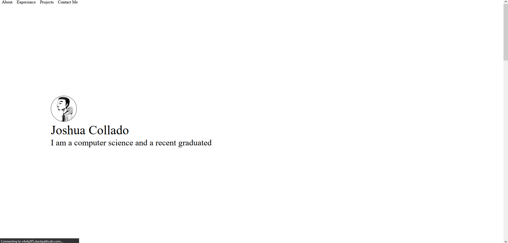

# Portfolio Website

Welcome to my portfolio repository! This project showcases my work and provides an overview of my skills and projects. 
```diff
- ***-This Portafolio Is Still Under Construction.-***
```

## Table of Contents

- [Overview](#overview)
- [Features](#features)
- [Installation](#installation)
- [Usage](#usage)
- [Technologies](#technologies)
- [Contributing](#contributing)
- [License](#license)
- [Contact](#contact)

## Overview

This is the third version of my portfolio website. It highlights my latest projects, skills, and provides information about me as a developer. The website is designed to be responsive and user-friendly. This website is under construction.

Old Portfolio:

 <!-- Will replace with actual path to screenshot -->

New Plan:

 <!-- Will replace with actual path to screenshot -->

## Features

- **Responsive Design:** Works seamlessly on various devices.
- **Project Showcases:** Displays my best work with detailed descriptions.
- **Contact Form:** Allows visitors to get in touch with me easily.
- **Interactive UI:** Engaging and smooth user experience.

## Installation

To run this project locally, follow these steps:

1. **Clone the repository:**
   ```bash
   git clone https://github.com/jocoso/portfolio-websitev.3.git
   ```

2. **Navigate to the project directory:**
   ```bash
   cd portfolio-websitev.3
   ```

3. **Install dependencies:**
   ```bash
   npm install
   ```

4. **Start the development server:**
   ```bash
   npm start
   ```

   The website should now be running at `http://localhost:3000`.

## Usage

After installation, you can explore the following sections:

- **Home:** Overview of my portfolio.
- **About:** Information about me.
- **Projects:** Detailed descriptions and links to my work.
- **Contact:** Form to reach out to me.

## Technologies

This project is built using the following technologies:

- **Frontend:** React, CSS, HTML
- **Backend:** Node.js 
- **Build Tools:** Webpack, Babel
- **Deployment:** Github Pages

## Contributing

Contributions are welcome! Here’s how you can help:

1. **Fork the repository.**
2. **Create a new branch:** `git checkout -b feature-branch`
3. **Make your changes and commit them:** `git commit -m 'Add new feature'`
4. **Push to the branch:** `git push origin feature-branch`
5. **Open a Pull Request.**

Please ensure your pull request adheres to the project's contribution guidelines.

## License

This project is licensed under the MIT License. See the [LICENSE](https://choosealicense.com/licenses/mit/) file for details.

## Contact

If you have any questions or feedback, feel free to reach out:

- **Email:** [joshua.collado022@gmail.com](mailto:joshua.collado022@gmail.com)
- **LinkedIn:** [Jocoso5273](https://www.linkedin.com/in/jocoso5273/)

---

Thank you for visiting my portfolio!
